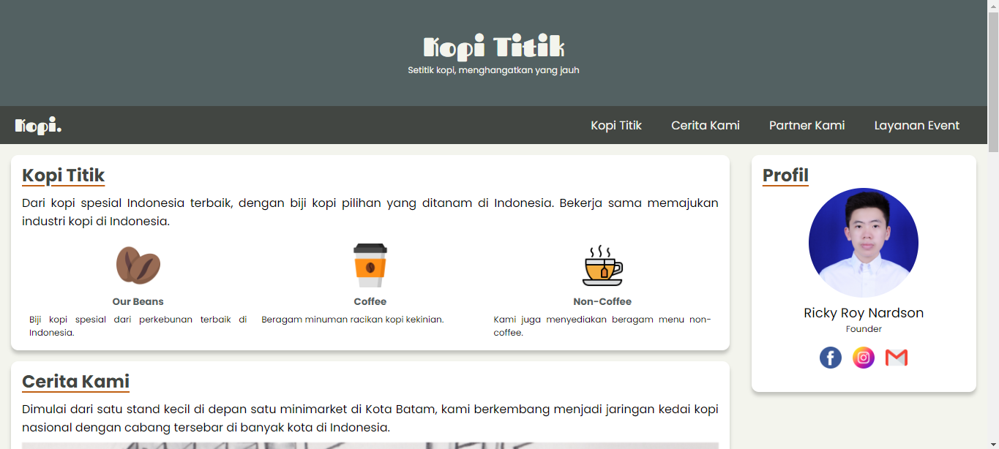
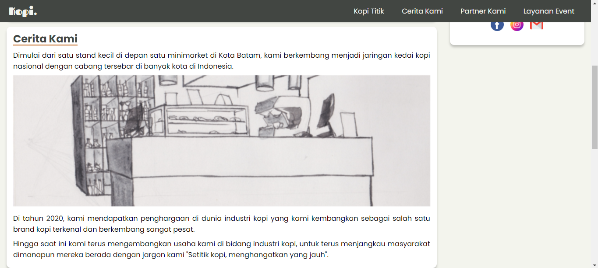
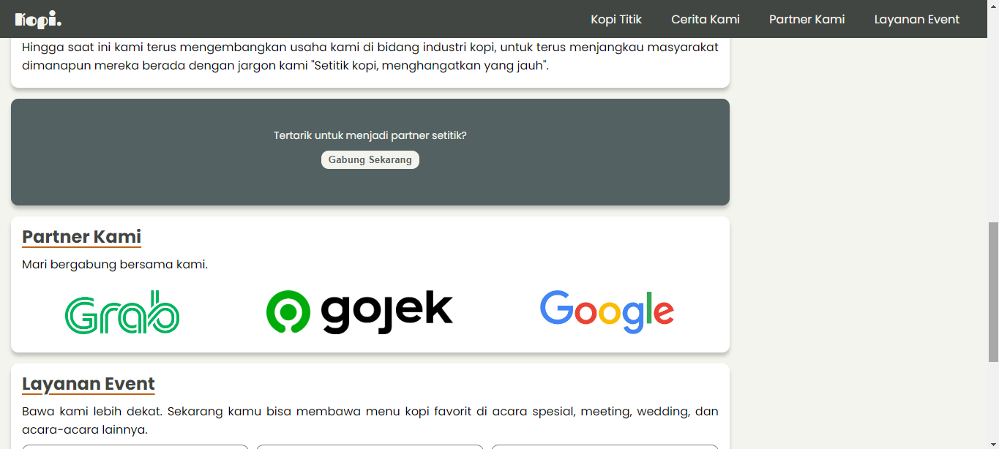
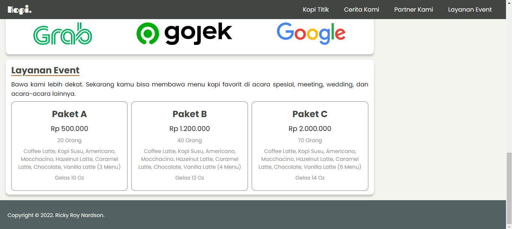
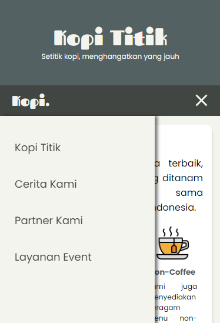
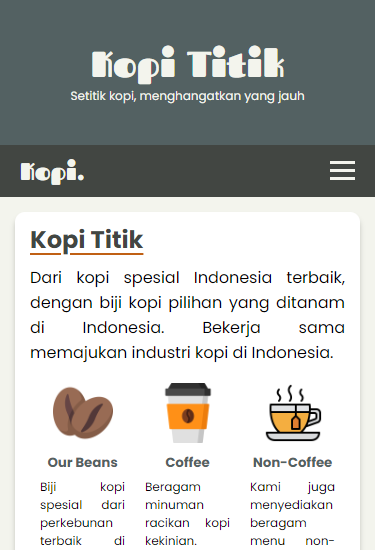
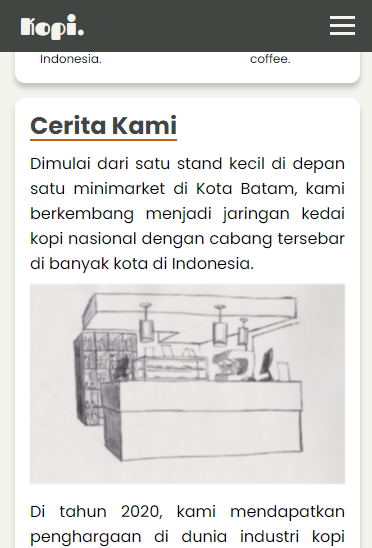
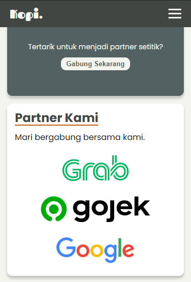
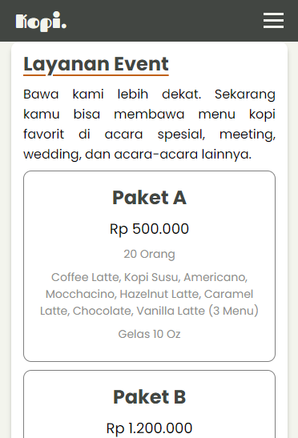

# Kopi Titik

Sebuah website profil sederhana yang dibuat dengan harapan agar tuntas di submission "Belajar Dasar Pemrograman Web" dari Dicoding.

# Implementasi JavaScript

JavaScript digunakan untuk:

- Dropdown navbar di versi mobile
- Menampilkan tahun di footer

# Preview

> Desktop

> Mobile

